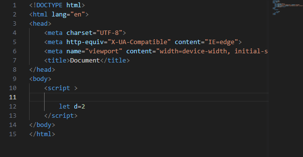
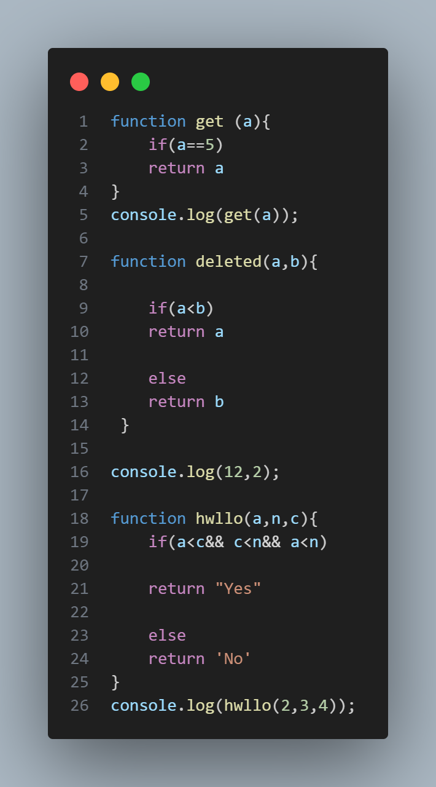
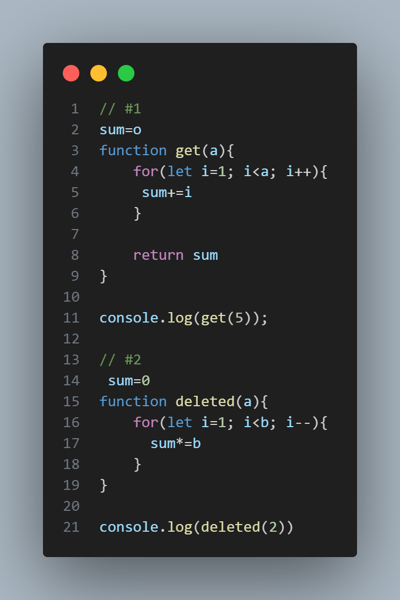
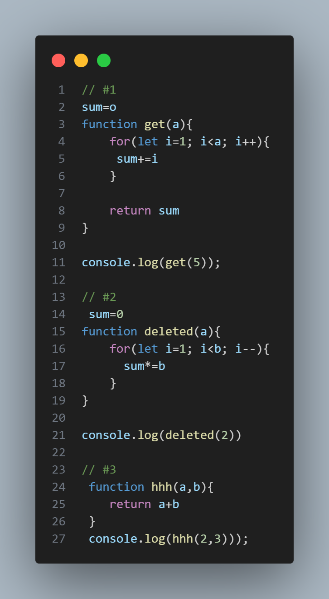
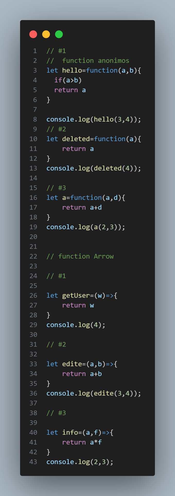

# Java Script

```
JavaScript — популярное программирование
язык, имеющий широкий спектр
Приложения.Ранее JavaScript использовался в основном для
создание интерактивных веб-страниц, таких как форма
валидация, анимация и т. д. В настоящее время
JavaScript также используется во многих других областях.
такие как серверная разработка, мобильная
разработка приложений и так далее.
```

# How me creat js file




# Varable in js

 ## JS has 3 varable


# Data Type in JS

### Primitive

* Number
* String
* Boolen
* Undefined
* null
* Bigint
* Sumbol

### Nanprimitive(Object)

* Object
* array
* function
* and others


# Operator in Js 


# Condition in js




# loops in Js


# Function in JS

* Function Declaration
* Function Expration
* Function IIEF


### Function Declaration 



### Function Expration 



###  Function IIEF

"# Lecture1" 
